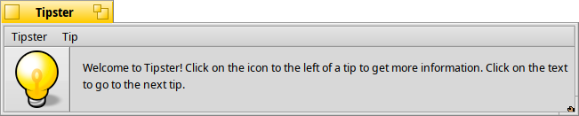

## HaikuTipster
Tipster is an application to display Haiku usage tips.

It displays brief but informative hints relating to interesting features about Haiku and their usage. It can be embedded as Replicant onto the Desktop and slideshow through the tips at a set interval.



Clicking on the category icon shown beside the tip opens a web page related to the tip's topic.

#### How to build/install

Building Tipster is simple:
```
make
make bindcatalogs
```

Tipster looks for its tip files in one of the data directories:

```
/boot/home/config/non-packaged/data
/boot/home/config/data
/boot/system/non-packaged/data
/boot/system/data
```

A recipe for Tipster is available at [HaikuPorts](https://github.com/haikuports/haikuports/wiki), a ready-made package is installable with HaikuDepot.